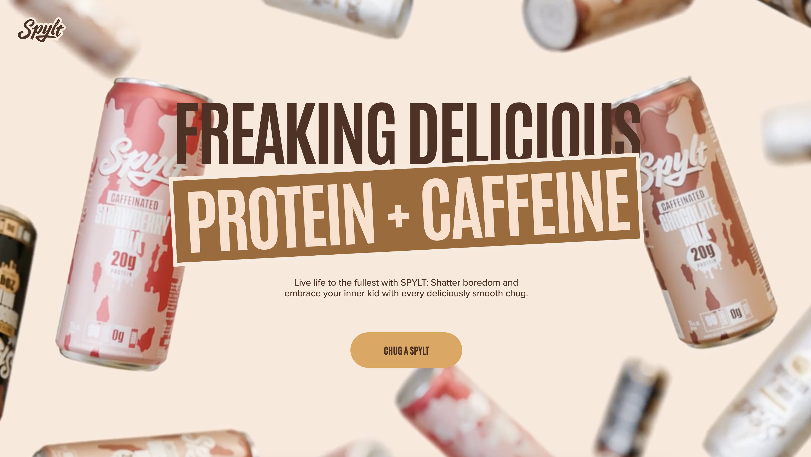

# SPYLT-GSAP 🚀🎨

_Unleash Dynamic Creativity with Seamless Motion_



> **Last Commit:** July 22, 2025  
> **Languages:** JavaScript (78.2%)  
> **Technologies Used:**       

---

## 📑 Table of Contents

- [Overview](#overview)
- [Why Spylt-Gsap?](#why-spylt-gsap)
- [Getting Started](#getting-started)
  - [Prerequisites](#prerequisites)
  - [Installation](#installation)
  - [Usage](#usage)
- [Credit](#credit)

---

## 📌 Overview

**Spylt-Gsap** is a developer-focused toolkit designed to streamline the creation of modern, animated React applications. It combines a robust setup with integrated styling, build optimization, and interactive features to accelerate development and enhance user engagement.

---

## ✨ Why Spylt-Gsap?

This project empowers developers to craft visually compelling, responsive web experiences with ease.

### ✅ Core Features:

- ⚡ **Fast Setup**: Integrates React, Tailwind CSS, and Vite for rapid development and hot module replacement.
- 🎞 **Smooth Animations**: Leverages GSAP for scroll-triggered, immersive animations.
- 🧹 **Code Quality**: Built-in ESLint configuration enforces best practices and code consistency.
- 🧩 **Modular Components**: Reusable UI elements like NavBar, ClipPath, and FlavorSlider streamline development.
- 📱 **Responsive Design**: Optimized for both desktop and mobile, ensuring a seamless user experience.

---

## 🚀 Getting Started

### 🧰 Prerequisites

Make sure you have the following installed on your machine:

- **JavaScript (ES6+)**
- **npm (Node Package Manager)**

### 🛠️ Installation

Clone the repository and install dependencies:

```bash
git clone https://github.com/Ahmed-Alaa-Attia/Spylt-Gsap
cd Spylt-Gsap
npm install
```

### ▶️ Usage

Run the development server:

```bash
npm run dev
```

Build for production:

```bash
npm run build
```

Lint the code:

```bash
npm run lint
```

---

## 🙌 Credit

This website was created as a tutorial project to **master GSAP** and React animation principles.

> **Full credit to [Fullstack Empire](https://www.youtube.com/@FullstackEmpire)** for the incredible learning resources and guidance in building this beautiful interactive site.

---
